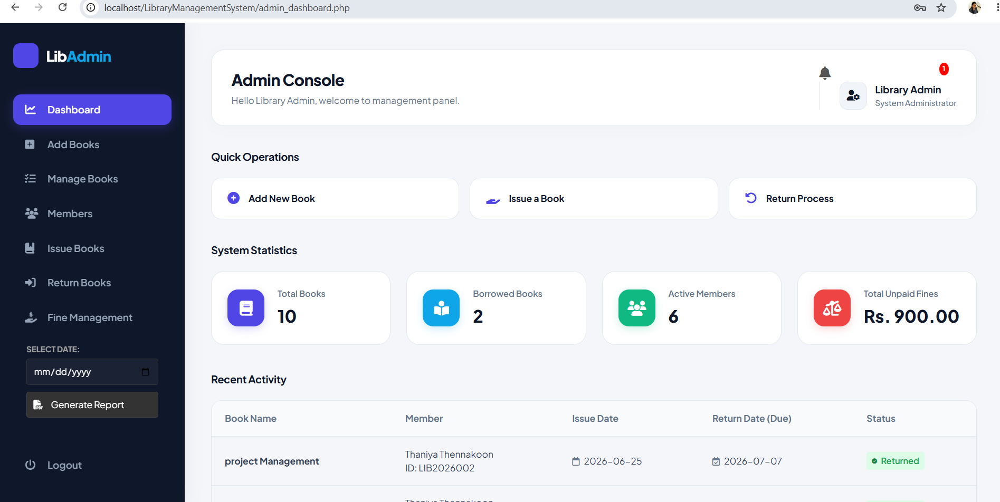
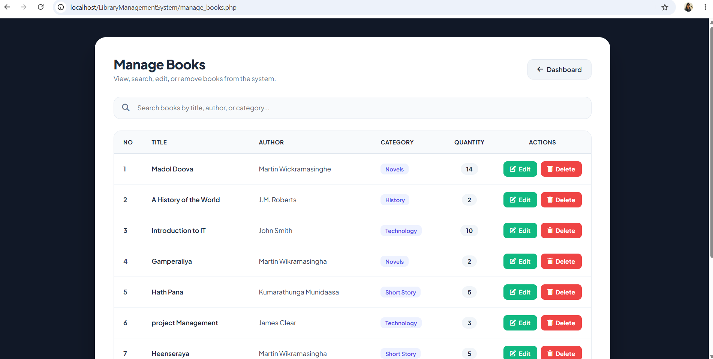
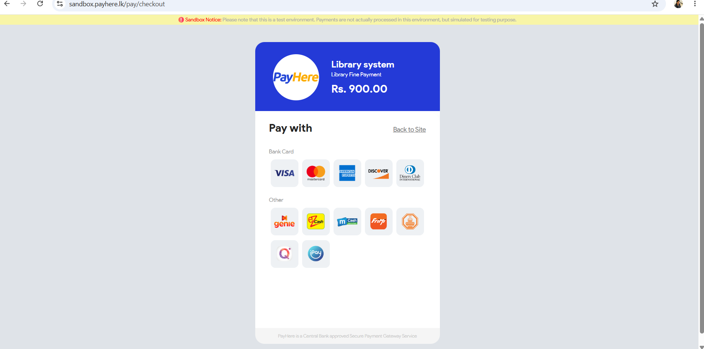

# Library Management System

A web-based Library Management System developed as an academic project to manage library operations efficiently.

## Project Overview

The Library Management System is designed to simplify common library activities such as managing books, members, borrowing requests, reservations, fines, and notifications.

The system provides separate functionalities for administrators and registered users.

## Main Features

### User Features

* Register and log in to the system
* Search and filter books
* View book availability
* Submit borrowing requests
* Reserve books
* View borrowed books
* View reservations
* View fines
* Make online fine payments using PayHere Sandbox
* Receive system notifications
* Manage user profile

### Admin Features

* Admin login and dashboard
* Manage books
* Manage book categories
* Manage members
* View and manage borrowing requests
* Manage issued and returned books
* Manage reservations
* Manage fines
* View library statistics
* Manage notifications

## Technologies Used

* HTML5
* CSS3
* JavaScript
* PHP
* MySQL
* WAMP Server
* phpMyAdmin
* Visual Studio Code
* PayHere Sandbox

## Database

MySQL is used as the database management system. It stores information about users, books, categories, borrowing records, reservations, fines, and notifications.

## Project Purpose

The main purpose of this project is to develop a computerized library system that reduces manual work and provides an efficient way to manage library services.

## Project Status

Completed as an academic project.

## Screenshots

### Home Page

### Login Page

### Admin Dashboard

### Add Books

### Manage Books

### Issue Books

### Pay Fines

### Profile

## Author

Thaniya Thennakoon
HND IT Undergraduate

